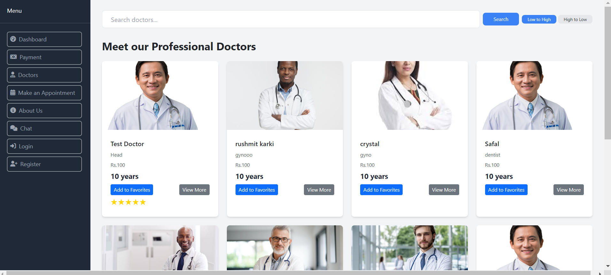
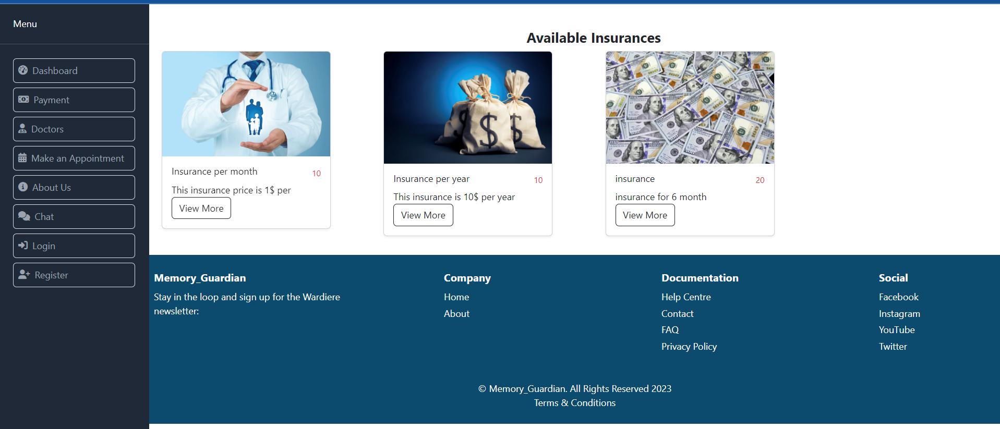
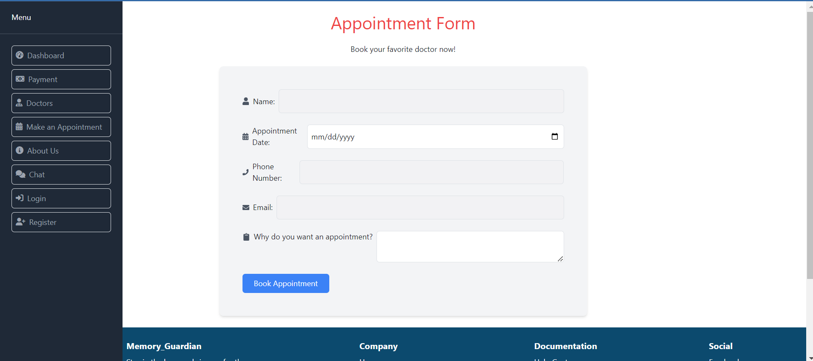
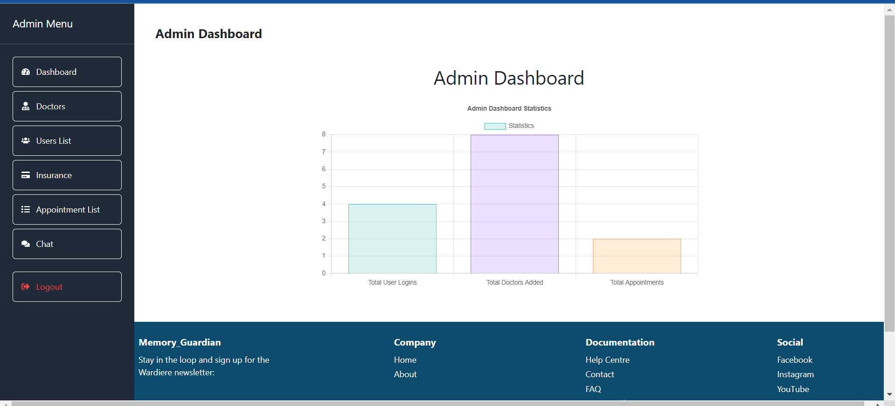
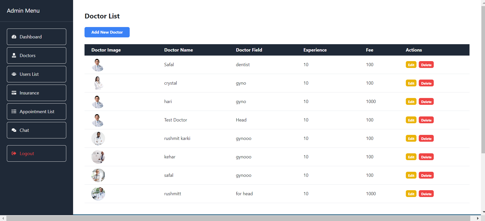
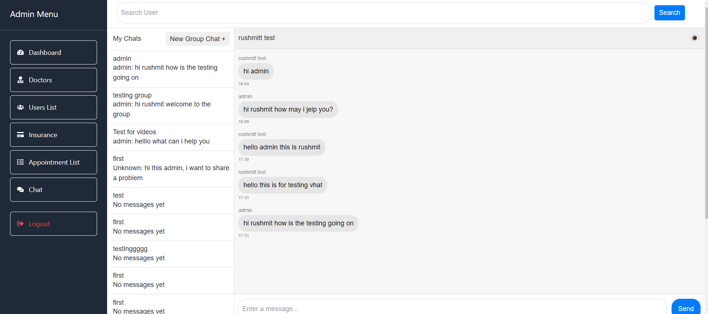
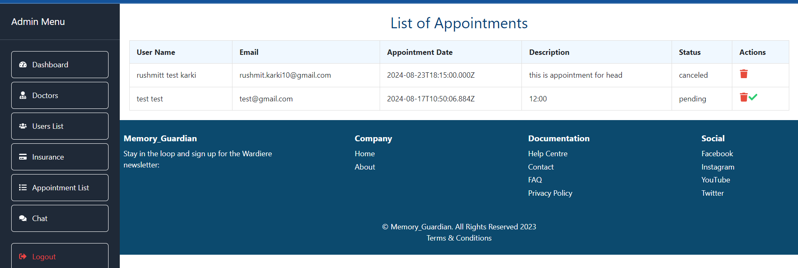

# Memory Guardian

A React-based frontend for the Memory Guardian platform, providing separate interfaces for users and admins to manage doctors, handle appointments, and facilitate communication. Create React App was used as the foundation for this project.

## Features

### User Role

- **View Doctors:** Browse through a list of available doctors.
- **Favorite Doctor:** Add doctors to a list of favorites for quick access.
- **Chat:** Communicate directly with doctors or the support team via a built-in chat feature.
- **Book Appointments:** Schedule appointments with available doctors.

### Admin Role

- **Add Doctor:** Add new doctors to the platform for users to view and book appointments.
- **Add Insurance:** Manage and add insurance options available for users.
- **Delete User:** Remove users from the platform who are no longer active or have violated terms.
- **Approve Appointments:** Review and approve appointment requests made by users.
- **Manage Doctors:** Update doctor information, including specialization, availability, and contact details.
- **Chat:** Communicate with users for support or appointment confirmation through a chat interface.

## UI/UX Design

- **Figma:** Used for wireframing and designing UI components to ensure a consistent and intuitive user experience.
- **Material Design:** Implemented Material Design principles to provide a clean, modern, and user-friendly interface.
- **Responsive Design:** Tailored the interface for multiple device types, ensuring an optimal user experience on desktops, tablets, and mobile devices.
- **User-Centered Design:** Focused on creating a seamless experience by understanding the needs of users and admins, ensuring that all features are easily accessible and intuitive to use.

## Technology Stack

- **React.js:** Core frontend library used to build dynamic user interfaces.
- **Tailwind CSS:** A utility-first CSS framework used to style the application, providing flexibility and consistency across components.
- **Node.js:** Backend runtime environment used to run server-side applications and handle API requests.
- **Express.js:** A web application framework for Node.js used to build the RESTful API for the platform.
- **MongoDB:** NoSQL database used to store user information, doctor profiles, appointments, and insurance details.
- **Socket.io:** Used to implement real-time chat functionality between users and admins.
- **Google Firebase:** Utilized for authentication services, particularly Google login for both users and admins.

## API Integration

The frontend interacts with the backend through a RESTful API, managing operations such as doctor management, appointment handling, user authentication, and chat functionality.

## Future Work

- **Advanced Doctor Matching:** Introduce an AI-based doctor matching feature that suggests doctors to users based on their medical needs and history.
- **Telemedicine Integration:** Implement a telemedicine feature allowing users to have virtual consultations with doctors.
- **Insurance Claims:** Allow users to submit insurance claims directly through the platform, streamlining the reimbursement process.
- **Appointment Reminders:** Implement automated reminders for upcoming appointments via SMS or email.
- **Health Records:** Integrate a system where users can upload and manage their medical records securely on the platform.

## Challenges

- **Chat Integration:** Implementing real-time chat functionality required ensuring reliable message delivery and managing various chat states.
- **Responsive Design:** Ensuring that the user interface remained consistent and functional across a wide range of devices and screen sizes was challenging, but Tailwind CSS provided the flexibility needed to create a responsive design.
- **API Integration:** Handling API requests for real-time doctor updates, user authentication, and chat services while maintaining smooth and secure communication was crucial and required thorough testing.

## Environment Variables

- **REACT_APP_API_URL:** The base URL for the backend API.
- **REACT_APP_GOOGLE_CLIENT_ID:** Your Google Client ID for authentication.
- **REACT_APP_CHAT_SERVICE_URL:** The URL for the chat service used to facilitate communication between users and admins.
- **REACT_APP_INSURANCE_SERVICE_URL:** The URL for the insurance management service.
- **REACT_APP_DOCTOR_MATCHING_SERVICE_URL:** The URL for the AI-based doctor matching service.
